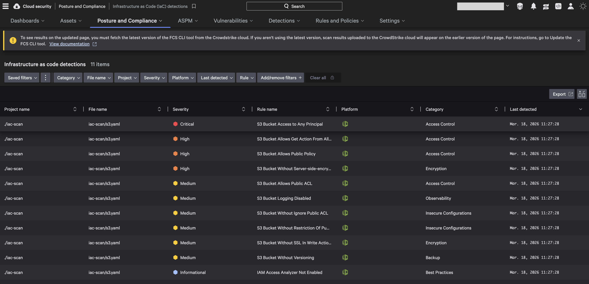
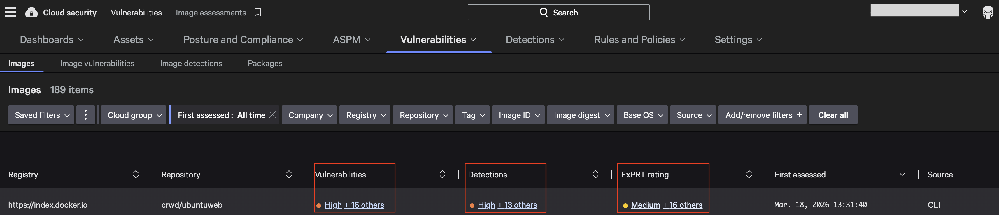

## This repository demonstrates the use of Falcon Cloud Security Github actions
FCS Github Action is available at https://github.com/marketplace/actions/crowdstrike-fcs-cli-github-action 

It is configured to scan during CI/CD workflow:
- A Cloudformation template that creates a publicly accessible S3 bucket
- A Docker container image

The results of the IAC scan for Cloudformation is uploaded to Falcon web console and is seen below:

The results of the image scan is uploaded to Falcon web console and is seen below:

